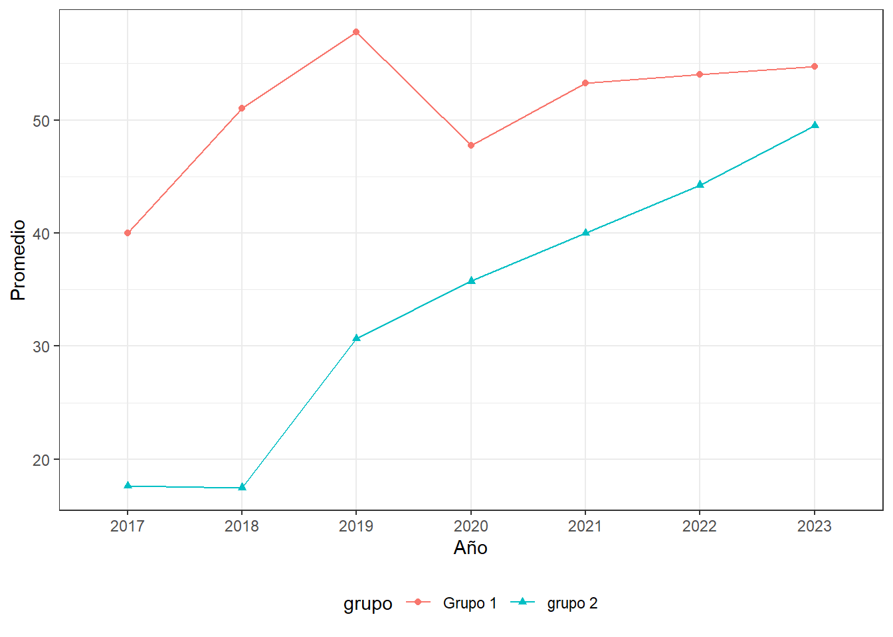

<link href="index_files/pagedtable/css/pagedtable.css" rel="stylesheet" />
<script src="index_files/pagedtable/js/pagedtable.js"></script>


Cuando hacemos análisis de los datos, la actividad que demanda el mayor tiempo consiste en realizar toda la limpieza, depuración y transformación de los datos para llevarlos a la estructura requerida por cada análisis que vayamos a implementar. Esta no es una tarea simple pero podemos apoyarnos en varias funciones que nos pueden facilitar el trabajo.

Suponga que se tiene un conjunto de datos a nivel de municipio con algunos indicadores por año, presentando la siguiente estructura:


```
## ── Attaching packages ─────────────────────────────────────── tidyverse 1.3.2 ──
## ✔ ggplot2 3.4.1      ✔ purrr   1.0.1 
## ✔ tibble  3.1.8      ✔ dplyr   1.0.10
## ✔ tidyr   1.2.1      ✔ stringr 1.5.0 
## ✔ readr   2.1.3      ✔ forcats 1.0.0
## Warning: package 'ggplot2' was built under R version 4.2.3
## Warning: package 'forcats' was built under R version 4.2.3
## ── Conflicts ────────────────────────────────────────── tidyverse_conflicts() ──
## ✖ dplyr::filter() masks stats::filter()
## ✖ dplyr::lag()    masks stats::lag()
```


```r
paged_table(datos)
```

<div data-pagedtable="false">
  <script data-pagedtable-source type="application/json">
{"columns":[{"label":["grupo"],"name":[1],"type":["dbl"],"align":["right"]},{"label":["Municipio"],"name":[2],"type":["chr"],"align":["left"]},{"label":["v_2017"],"name":[3],"type":["dbl"],"align":["right"]},{"label":["v_2018"],"name":[4],"type":["dbl"],"align":["right"]},{"label":["v_2019"],"name":[5],"type":["dbl"],"align":["right"]},{"label":["v_2020"],"name":[6],"type":["dbl"],"align":["right"]},{"label":["v_2021"],"name":[7],"type":["dbl"],"align":["right"]},{"label":["v_2022"],"name":[8],"type":["dbl"],"align":["right"]},{"label":["v_2023"],"name":[9],"type":["dbl"],"align":["right"]}],"data":[{"1":"1","2":"11001","3":"53","4":"65","5":"74","6":"48","7":"67","8":"68","9":"79"},{"1":"1","2":"05001","3":"37","4":"49","5":"54","6":"61","7":"60","8":"59","9":"58"},{"1":"1","2":"08001","3":"25","4":"38","5":"45","6":"33","7":"36","8":"34","9":"33"},{"1":"1","2":"76001","3":"45","4":"52","5":"58","6":"49","7":"50","8":"55","9":"49"},{"1":"2","2":"88001","3":"15","4":"13","5":"17","6":"20","7":"25","8":"26","9":"28"},{"1":"2","2":"63001","3":"17","4":"25","5":"33","6":"48","7":"55","8":"58","9":"65"},{"1":"2","2":"50001","3":"21","4":"28","5":"42","6":"50","7":"52","8":"58","9":"60"},{"1":"2","2":"23001","3":"NA","4":"4","5":"NA","6":"25","7":"28","8":"35","9":"45"}],"options":{"columns":{"min":{},"max":[10]},"rows":{"min":[10],"max":[10]},"pages":{}}}
  </script>
</div>

Ahora pensemos en que se desea realizar un resumen de las estadísticas básicas por grupo, o que deseamos realizar una gráfica de tendencias. A continuación ilustro algunas funciones que pueden ayudar a agilizar estas tareas.

## Resumen de múltiples variables 

Cuando hablamos de depurar datos en R, también conocido como proceso de `data wrangling`, uno de los paquetes más utilizados es `dplyr`, incluido en el entorno `tidyverse`.  Estos procesos suelen ser los que más demandan tiempo dentro del ciclo de la analítica de los datos, y de ello depende en gran medida la calidad de los datos. 

Dentro de los verbos de `dplyr` los comandos `starts_with("prefijo")` permiten seleccionar las variables que inician con determinado patrón o `ends_with("sufijo")` para las variables que finalizan con determinado patrón. Si buscamos resumir una gran cantidad de variables que comparten un prefijo o un sufijo, se pueden usar `summarise_at` para afectar a un conjunto de variables o el comando `across`

### Usando `summarise_at`

En este caso se creará el objeto `res1` que contiene la información de la media y la desviación estándar para todas las variables que inician con el prefijo `v_20`, resumidas por la variable grupo.


```r
(res1 <- datos |>  
         group_by(grupo) |> 
         summarise_at(vars(starts_with("v_20")), 
                     list(media = ~mean(., na.rm = T), 
                          desv.est = ~sd(., na.rm = T)))) 
## # A tibble: 2 × 15
##   grupo v_2017_media v_2018_media v_2019_media v_2020_media v_2021_media
##   <dbl>        <dbl>        <dbl>        <dbl>        <dbl>        <dbl>
## 1     1         40           51           57.8         47.8         53.2
## 2     2         17.7         17.5         30.7         35.8         40  
## # ℹ 9 more variables: v_2022_media <dbl>, v_2023_media <dbl>,
## #   v_2017_desv.est <dbl>, v_2018_desv.est <dbl>, v_2019_desv.est <dbl>,
## #   v_2020_desv.est <dbl>, v_2021_desv.est <dbl>, v_2022_desv.est <dbl>,
## #   v_2023_desv.est <dbl>
```

### Usando `across`

A diferencia del caso anterior, cuando se usa la función `across`, se realiza sobre el verbo general `summarise()`, el primer argumento indicará cuáles son las variables que se van a afectar, que en este caso corresponde a las variables con prefijo `v_20`, para las cuales se calcula la media y desviación estándar por grupo. Hacerlo de esta forma evita el uso de verbos como `summarise_all()`, `summarise_at()` o `summarise_if()`.


En este caso, también se le asignó a cada variable de resumen un nombre con el argumento `.names = "{fn}_del_{col}"` que toma como prefijo el nombre asignado a la función (media o desv.est), separa con una barra al piso, seguido por la palabla _del_ y finaliza con el nombre de la variable original.


```r
(res2 <- datos |>  
         group_by(grupo) |> 
         summarise(across(starts_with("v_20"), 
                   list(media = ~mean(., na.rm = T), 
                        desv.est = ~sd(., na.rm = T)), 
                          .names = "{fn}_del_{col}")))
## # A tibble: 2 × 15
##   grupo media_del_v_2017 desv.est_del_v_2017 media_del_v_2018
##   <dbl>            <dbl>               <dbl>            <dbl>
## 1     1             40                 11.9              51  
## 2     2             17.7                3.06             17.5
## # ℹ 11 more variables: desv.est_del_v_2018 <dbl>, media_del_v_2019 <dbl>,
## #   desv.est_del_v_2019 <dbl>, media_del_v_2020 <dbl>,
## #   desv.est_del_v_2020 <dbl>, media_del_v_2021 <dbl>,
## #   desv.est_del_v_2021 <dbl>, media_del_v_2022 <dbl>,
## #   desv.est_del_v_2022 <dbl>, media_del_v_2023 <dbl>,
## #   desv.est_del_v_2023 <dbl>
```


## Reubicación de variables

Es posible que quiera ordenar su conjunto de datos para dejar algunas variables al inicio o al final. Una posibilidad es usar el verbo `select()` pero esto le implicaría indicar el orden de cada una de las variables, lo cual resulta tedioso. Una solución para este inconveniente es utilizar el verbo `relocate()` listando las variables de interés y especificando un argumento `.before` o `.after` para indicar si las quiere antes o después de alguna variable específica.

En el siguiente ejemplo se toma el conjunto de datos `res2` obtenido previamente y las variables se reordenan colocando todas las medias en un primer bloque (luego de la variable grupo), de manera que las desviaciones estándar quedarán en un siguiente bloque.


```r

(res3 <- res2 |> 
         relocate(starts_with("media"), .after = grupo))
## # A tibble: 2 × 15
##   grupo media_del_v_2017 media_del_v_2018 media_del_v_2019 media_del_v_2020
##   <dbl>            <dbl>            <dbl>            <dbl>            <dbl>
## 1     1             40               51               57.8             47.8
## 2     2             17.7             17.5             30.7             35.8
## # ℹ 10 more variables: media_del_v_2021 <dbl>, media_del_v_2022 <dbl>,
## #   media_del_v_2023 <dbl>, desv.est_del_v_2017 <dbl>,
## #   desv.est_del_v_2018 <dbl>, desv.est_del_v_2019 <dbl>,
## #   desv.est_del_v_2020 <dbl>, desv.est_del_v_2021 <dbl>,
## #   desv.est_del_v_2022 <dbl>, desv.est_del_v_2023 <dbl>
```

## Resumen de estadísticas por filas

En ocasiones deseamos obtener un resumen de las estadísticas para un conjunto de variables, en el caso del conjunto de datos de ejemplo podríamos estar interesados en calcular la media o la desviación estándar para cada municipio. Una manera de hacerlo es con el adverbio `c_across`, especificando previamente que los cálculos se harán por fila, para esto usamos el verbo `rowwise()`


```r
datos |> 
  rowwise() |> 
  dplyr::mutate(media = mean(c_across(starts_with("v_20")), na.rm = T))
## # A tibble: 8 × 10
## # Rowwise: 
##   grupo Municipio v_2017 v_2018 v_2019 v_2020 v_2021 v_2022 v_2023 media
##   <dbl> <chr>      <dbl>  <dbl>  <dbl>  <dbl>  <dbl>  <dbl>  <dbl> <dbl>
## 1     1 11001         53     65     74     48     67     68     79  64.9
## 2     1 05001         37     49     54     61     60     59     58  54  
## 3     1 08001         25     38     45     33     36     34     33  34.9
## 4     1 76001         45     52     58     49     50     55     49  51.1
## 5     2 88001         15     13     17     20     25     26     28  20.6
## 6     2 63001         17     25     33     48     55     58     65  43  
## 7     2 50001         21     28     42     50     52     58     60  44.4
## 8     2 23001         NA      4     NA     25     28     35     45  27.4
```

## Reestructurar a lo largo

En ocasiones es útil dar una estructura larga al conjunto de datos, esto puede agilizar algunos procesos. En nuestro conjunto de datos cada municipio es una fila y los datos por año se encuentran en las columnas y posteriormente fue resumido con las estadísticas de la media y desviación estándar por grupo. Si nuestro propósito fuera generar una gráfica del comportamiento de cada grupo por año, esta estructura resultaría un poco compleja de manejar. 

En el siguiente ejemplo se usa `pivot_longer()` para pivotear la tabla y ponerla hacía lo largo. En los argumentos se le indica que la columna _grupo_ es la única que no se afectará (_cols = -grupo_), en el argumento `names_to` se le ha indicado que vamos a crear dos columnas a partir del nombre de las variables de los datos originales, estas se denominarán _estadistica_ y _anio_; ahora es necesario indicarle el patrón que tiene los nombres de las variables con el fin de que los pueda separar, así que el comando `names_pattern = "(.*)_del_v_(.*)"` les está indicando que el patrón debe ser: tomar todo lo que está antes de "_del_v_" y lo conservará en la columna _estadistica_, mientras que todo lo que esté posterior a ese patrón lo conservará en la columna _anio_. Los valores correspondientes se almancenan en la columna _valor_.


```r
(reesL <- res2 |>  
         pivot_longer(cols = -grupo, 
               names_to = c("estadistica", "anio"), 
               names_pattern = "(.*)_del_v_(.*)", 
               values_to = "valor"))
## # A tibble: 28 × 4
##    grupo estadistica anio  valor
##    <dbl> <chr>       <chr> <dbl>
##  1     1 media       2017   40  
##  2     1 desv.est    2017   11.9
##  3     1 media       2018   51  
##  4     1 desv.est    2018   11.1
##  5     1 media       2019   57.8
##  6     1 desv.est    2019   12.1
##  7     1 media       2020   47.8
##  8     1 desv.est    2020   11.5
##  9     1 media       2021   53.2
## 10     1 desv.est    2021   13.5
## # ℹ 18 more rows
```

Ahora sería relativamente rápido hacer un gráfico de las medias


```r
p <- reesL |> 
  filter(estadistica == "media") |> 
  mutate(grupo = factor(grupo, levels = 1:2, labels=c("Grupo 1", "grupo 2"))) |> 
  ggplot(aes(x = anio, y = valor, group = grupo, color = grupo, shape = grupo)) +
  geom_line() +
  geom_point() +
  labs(x = "Año", y = "Promedio") +
  theme_bw() +
  theme(legend.position = "bottom")

p
```




## Reestructurar a lo ancho

Es posible que la estructura anterio no sea de todo su agrado, y que prefiera tener una columna con la media y otra con la desviación estándar. Para ello, el conjunto se puede convertir a un formato ancho de la siguiente manera


```r
(reesA <- reesL |> 
         pivot_wider(names_from = estadistica,
                     values_from = valor))
## # A tibble: 14 × 4
##    grupo anio  media desv.est
##    <dbl> <chr> <dbl>    <dbl>
##  1     1 2017   40      11.9 
##  2     1 2018   51      11.1 
##  3     1 2019   57.8    12.1 
##  4     1 2020   47.8    11.5 
##  5     1 2021   53.2    13.5 
##  6     1 2022   54      14.4 
##  7     1 2023   54.8    19.2 
##  8     2 2017   17.7     3.06
##  9     2 2018   17.5    11.1 
## 10     2 2019   30.7    12.7 
## 11     2 2020   35.8    15.5 
## 12     2 2021   40      15.7 
## 13     2 2022   44.2    16.3 
## 14     2 2023   49.5    16.7
```

Otro ejemplo puede ser revertir el conjunto de datos largo y llevarlo a la estructura inicial, que se puede realizar de la siguiente forma


```r
(reesA2 <- reesL |> 
          pivot_wider(names_from = c("estadistica", "anio"),
                     values_from = valor))
## # A tibble: 2 × 15
##   grupo media_2017 desv.est_2017 media_2018 desv.est_2018 media_2019
##   <dbl>      <dbl>         <dbl>      <dbl>         <dbl>      <dbl>
## 1     1       40           11.9        51            11.1       57.8
## 2     2       17.7          3.06       17.5          11.1       30.7
## # ℹ 9 more variables: desv.est_2019 <dbl>, media_2020 <dbl>,
## #   desv.est_2020 <dbl>, media_2021 <dbl>, desv.est_2021 <dbl>,
## #   media_2022 <dbl>, desv.est_2022 <dbl>, media_2023 <dbl>,
## #   desv.est_2023 <dbl>
```

